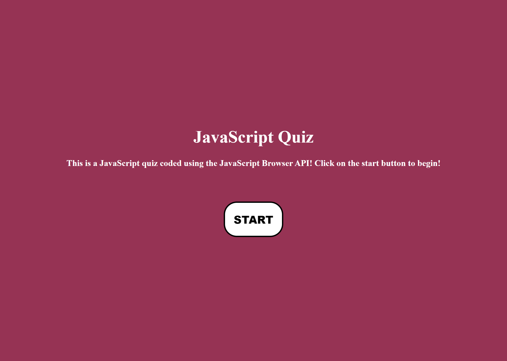
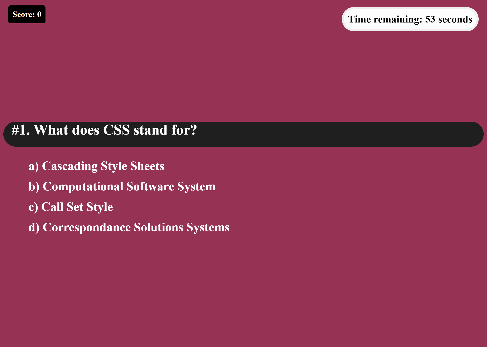

# JavaScript Quiz

## Description

this is a JavaScript quiz, coded using JavaScript APIs. The user picks their answer to each question and when either all questions have been answered or the time runs out, the quiz ends and a log of all the scores for this game and all previous games are displayed.

## Visuals

## Usage

simply click on whatever answer you'd like with your mouse. Your score is logged in the top left, and the timer is in the top right. If you get a question wrong, 5 seconds are removed from your timer.

[https://github.com/zaingova/zaingova-javascript-quiz](https://github.com/zaingova/zaingova-javascript-quiz)

## Support

For any questions, please e-mail me at zain.gova@yahoo.com or message me on Slack.

## Authors

Source code by Zain Gova. Used the JS Web API.

## Licence

Standard MIT Licence

